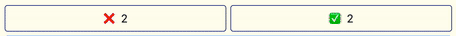

# Memoji

A memory game with emojis

## Shuffle

## Card flips

## Matches

## Tallies

## Solve

## Confetti

# Built With

- [React](https://reactjs.org/) - Framework
- [Babel](https://babeljs.io/) - Compiler
- [Parcel](https://parceljs.org/) - Bundler
- [ESLint](https://eslint.org/) - Linter
- [Prettier](https://prettier.io/) - Formatter
- [prop-types](https://www.npmjs.com/package/prop-types) - Typing
- [canvas-confetti](https://www.npmjs.com/package/canvas-confetti) - Confetti

# Author

- **Kent Warren** - [Portfolio](https://kent-warren.bss.design/) - [LinkedIn](https://www.linkedin.com/in/theartofwarren)

# License

This project is licensed under the MIT License - see the [LICENSE](LICENSE) file for details
